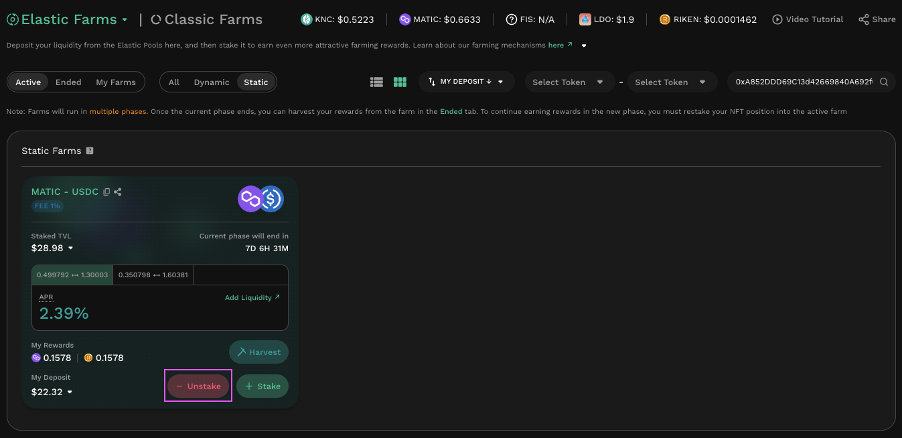

# Yield Farming On Static Farms


#### Static Farms: Rewards independent from market conditions

Following feedback on Dynamic Farms, KyberSwap has introduced an alternative Elastic Farming mechanism in Static Farms to enable for more customizable reward distribution parameters.&#x20;

Unlike Dynamic Farms which requires the underlying liquidity position to support the active market price, Static Farms enable LPs to continue earning farming rewards by contributing liquidity towards an operator defined farm range. Please refer to [Tick-Based Farming](../concepts/tick-based-farming.md) for a detailed comparison between the two mechanisms.

For a guide on Dynamic Farms, please refer to [Yield Farming On Dynamic Farms](yield-farming-on-dynamic-farms.md).


## Introduction

Yield Farming or Liquidity Mining is an aspect of DeFi that allows Liquidity Providers (LPs) to passively earn a return on capital contributed to a liquidity pool. The Yield Farm provides LPs with rewards over time to incentivize LPs to continue to provide liquidity to the pool as well as to help offset their risk.

This guide covers yield farming on KyberSwap Elastic Static Farms. It covers the following aspects of yield farming on KyberSwap Elastic:

* [Staking Liquidity Positions](yield-farming-on-static-farms.md#staking-liquidity-positions)
* [Harvesting and Claiming Rewards](yield-farming-on-static-farms.md#harvesting-and-claiming-rewards)
* [Unstaking Liquidity Positions](yield-farming-on-static-farms.md#unstaking-liquidity-positions)

Liquidity Provider Flow

Still deciding on which solution suits you best?&#x20;

* **Overview**: [Earn Yield By Contributing Liquidity](../../../kyberswap-solutions/kyberswap-interface/user-guides/earn-yield-by-contributing-liquidity.md)
* **Detailed comparison**:  [Classic vs Elastic](../../classic-vs-elastic/)&#x20;

#### Next steps

1. [Connect Your Wallet](../../../kyberswap-solutions/kyberswap-interface/user-guides/connect-your-wallet.md)
2. [Switching Networks](../../../kyberswap-solutions/kyberswap-interface/user-guides/selecting-preferred-network.md)
3. [Elastic Pool Creation ](elastic-pool-creation.md)
4. [Add Liquidity To An Existing Elastic Pool ](add-liquidity-to-an-existing-elastic-pool.md)
5. [Increasing Liquidity On Elastic](increasing-liquidity-on-elastic.md)&#x20;
6. [Elastic Fee Collection](elastic-fee-collection.md)&#x20;
7. **Yield Farming**
   * [On Dynamic Farms](yield-farming-on-dynamic-farms.md)
   * **On Static Farms <-**
8. [Removing Liquidity On Elastic](removing-liquidity-on-elastic.md)

## Static Farm innovations

Elastic Static Farms introduces a novel method for farming rewards to be distributed purely based upon a staker contributing liquidity towards an operator-specified farming range. Unlike the earlier Dynamic Farms where farmers would only receive rewards if their liquidity position supports the actively traded range, farmers in Static Farms are eligible for rewards as long as their liquidity positions encompasses a farming range. In other words, instead of rewards distribution being dictated by the markets, both farming operators and stakers gain autonomy over how the rewards are distributed as well as claimed.

The introduction of farming ranges and range weights were key to achieving this feature and more details regarding the mechanisms as well as examples can be found on the [Tick-Based Farming](../concepts/tick-based-farming.md) concept walkthrough. For the purposes of this guide, you will just need to note that:

* Each farm can consist of multiple overlapping farm ranges which is configured by the farm operator. The farm operator will also configure a weight for each range which determines the proportion of total rewards that will accrue to staked positions. Please refer to [Static Farms APR calculation](../concepts/apr-calculations.md#elastic-farm-v2-apr-calculation) for exact details on how returns are calculated.
* Each liquidity position can only be staked to a single farm range. The range of the position must be greater or equal to the farming range. Note that the optimal rewards are received when the position range is equal to the farm range as this is when all contributed liquidity is staked to a specific range. Please refer to [My Static Farm APR calculation](../concepts/apr-calculations.md#elastic-farm-v2-apr-calculation) for exact details on how returns are calculated for a specific position.

## Staking liquidity positions

To be eligible to earn rewards, you will first need to stake some liquidity positions. A guide on how to do this can be found [here](add-liquidity-to-an-existing-elastic-pool.md).

### **Step 1**: Select farm and open a position

<figure><figcaption>
Select Static Farm
</figcaption></figure>

You can view and filter the list of active farms on the [Farms page](https://kyberswap.com/farms/). For the purposes of this guide, we will use a MATIC - USDC pool with a fee tier of 1% on Polygon PoS.&#x20;


#### Static Farms rewards eligibility

To be eligible for farming range rewards, your underlying position must be equal or wider than the farming range. Positions which match the specified farming range will receive the maximum farming rewards.

Each position is only eligible to be staked in a single farming range to avoid double-counting of rewards.

You can refer to [Static Farms concept guide](../concepts/tick-based-farming.md#static-farms) if you require further details regarding the Static Farms mechanism.


Do note that an existing position will be required to be eligible for farming rewards. This can be easily achieved with the Static Farms add liquidity helper which enables opening a position that matches exactly with the farming range and thereby maximizing farming rewards.

<figure><figcaption>
Open liquidity position
</figcaption></figure>

For the complete guide on how to add liquidity to an Elastic pool, please refer to [Add Liquidity To An Existing Elastic Pool](add-liquidity-to-an-existing-elastic-pool.md). You can skip this section if you have an existing eligible position.

Note that the list of available static farms can also be viewed by using the preset filters on the top left of the screen.&#x20;

### Step 2: Approve the farming contract

<figure><figcaption>
Approve farming contract
</figcaption></figure>

If this is your first time interacting with Elastic Static Farms on this particular network, you will need to give approval for the farming smart contract to manage your wallet and balances.

Click on the “Approve Farming Contract” button on the Farms page to begin. This will require an onchain approval through your Web3 wallet.

Note: Be sure to check that the smart contract address is correct before authorizing the smart contract. KyberSwap Elastic farming smart contract addresses can be found [here](../contracts/elastic-farming-contract-addresses.md).

### **Step 3**: Stake your position in the farm

Once the Static Farm contract has been approved, the “+ Stake” button will then become available for farms where you have an eligible position.

<figure><figcaption>
Stake to earn farming rewards
</figcaption></figure>

Search for your reward pool and click on the “+ Stake” button to stake your NFT position. You can also toggle between the various eligible farming ranges in the farm card to view the estimated APRs. You can refer to [Static Farm APR calculation](../concepts/apr-calculations.md#static-farm-apr-calculation) for further details on how this estimate is computed.

### Step 4: Select farming range

<figure><figcaption>
Select position to stake into farming range
</figcaption></figure>

In the position staking helper, you can select the farming range for staking based on the tabs provided. When you've narrowed down the specific farming range, you can select the position to be staked and proceed to stake by clicking the "+ Stake Selected" button. Note that if you have multiple eligible positions, you can select any number of positions to be staked in a single transaction.

### Step 5: View staked position and rewards

<figure><figcaption>
View farming rewards
</figcaption></figure>

Once your position has been staked into the farming range, it will immediately begin earning farming rewards. You can view the rewards accrued to your staked position under the previous Farms page. Your position will continue to accumulate rewards for the duration of the farming phase.

## Harvesting and claiming rewards

After you have accumulated rewards, you can harvest them from the pool and subsequently claim them (i.e. withdraw rewards to your wallet).

### **Step 1**: Select pools to harvest

From the Farms page, click on the small “pickaxe” button associated with your desired pool to bring up the Harvest screen.&#x20;

<figure><figcaption>
Harvest farming rewards
</figcaption></figure>

### Step 2: Confirm harvest

From the Harvest screen that appears, click on the “Harvest” button to proceed. This is an onchain transaction that will require wallet confirmation.

## Unstaking liquidity positions

Unlike Dynamic Farms where your position stops earning farming rewards if the market price is outside the position's range, Static Farm positions will continue to earn farming rewards regardless of the market price. You may choose to unstake from a farming range at any time, even while the farm is still active.

### **Step 1: Select pool to unstake**

On the Farms page, click on the “- Unstake” button of the pool you would like to unstake from.

<figure><figcaption>
Unstake farming position
</figcaption></figure>

### Step 2: Confirm unstake

<figure><figcaption>
Select position to unstake
</figcaption></figure>

In the unstake preview, select the liquidity position(s) that you would like to unstake and then click the “Unstake Selected” button. Note that if there are multiple staked positions, you will be able to select any number of positions to be unstaked in the same transaction. This is an onchain transaction.

As part of this action, any as-yet unharvested rewards will also automatically be harvested.
