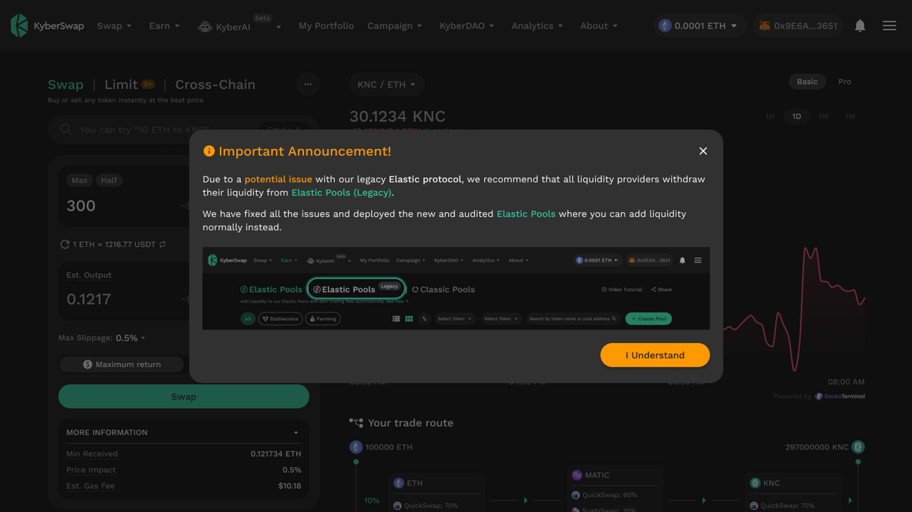
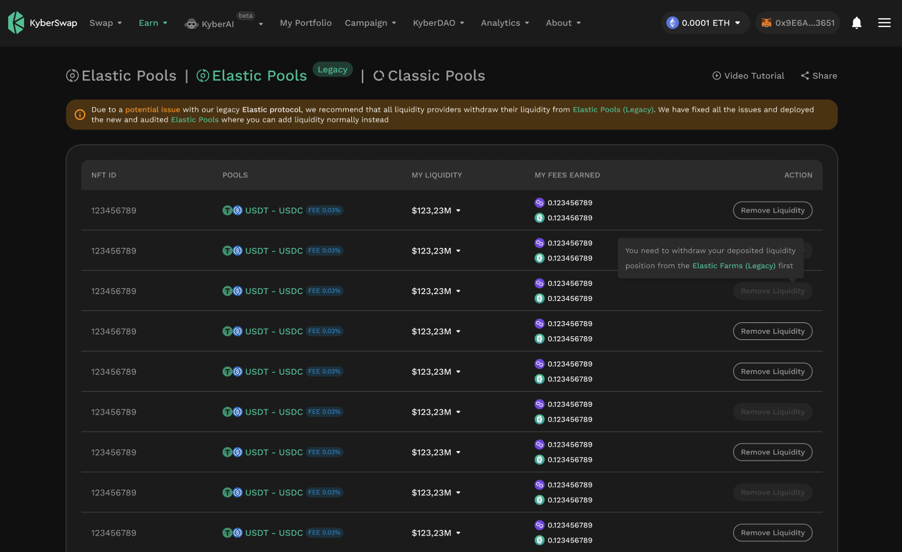
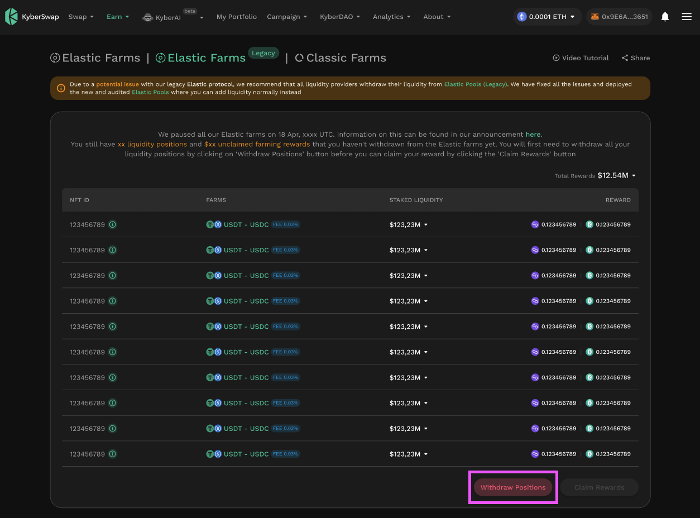
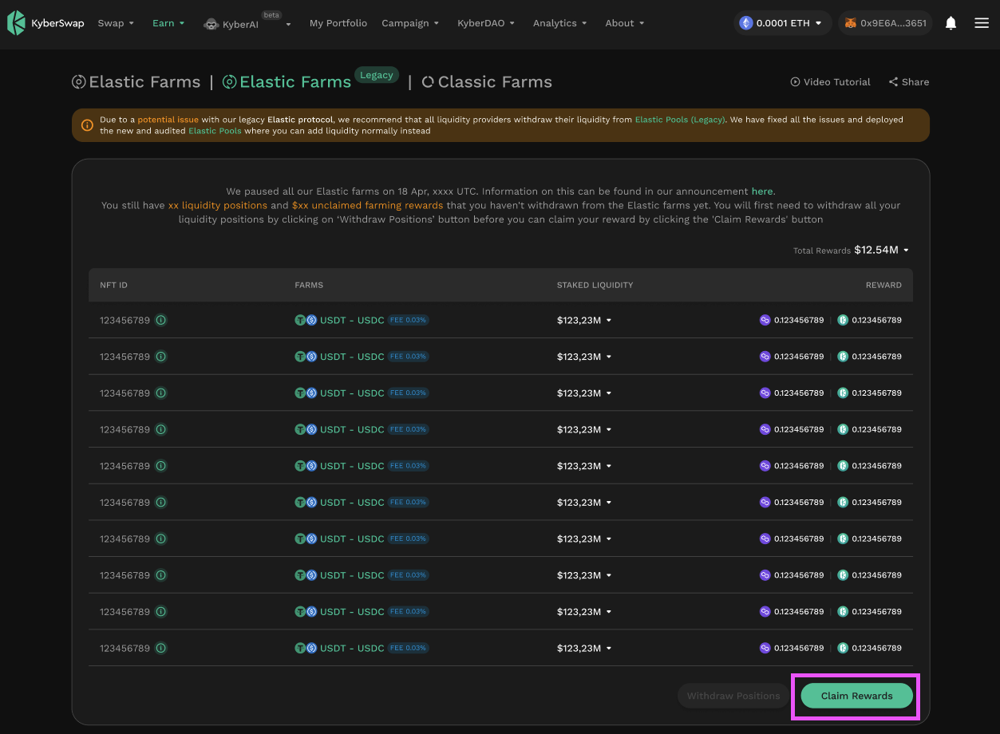
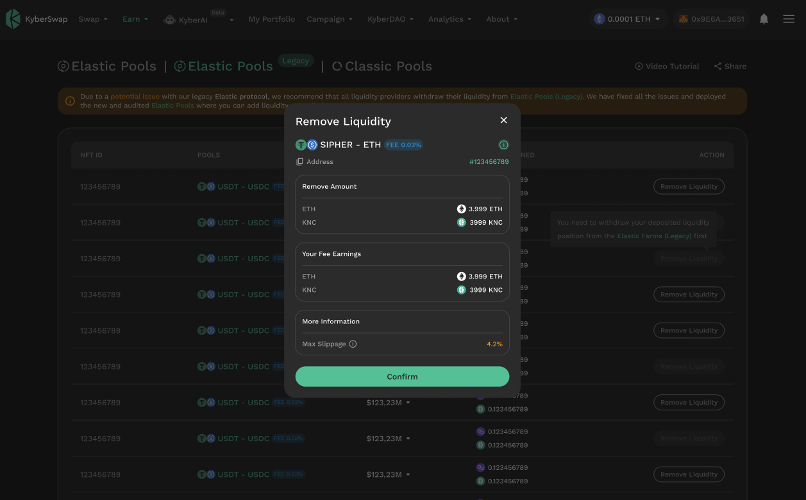
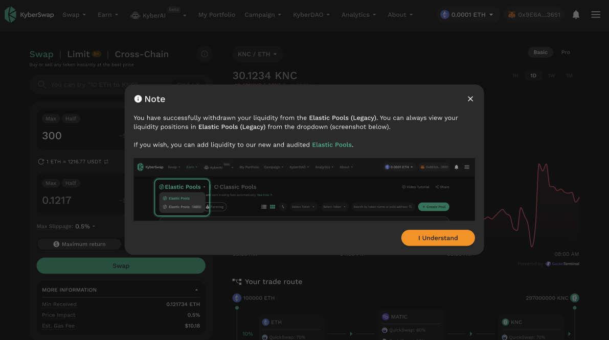

# Remove Elastic Legacy Liquidity

## Introduction

On 17 April 2023, KyberSwap validated a vulnerability reported by a whitehat hacker which could result in double-counting of liquidity deposits under a specific condition. Elastic pools and farms were paused with all user funds being safely withdrawn from the identified contracts. As of 25 May 2023, this has now been fixed with all the relevant Elastic protocol and farm contracts updated.&#x20;

This guide is targeted at users who still have tokens in the old Elastic Legacy contracts. As trades against Elastic Legacy contracts have been disabled to ensure the safety of liquidity provider funds, it is highly recommended that such idle funds be removed from Elastic Legacy. Users always maintain control over their own funds and are free to decide how best to utilize their funds whether it is for [yield farming in the newly audited Elastic contracts](broken-reference) or other purposes.

## Removing liquidity from Elastic Legacy

### Step 1: Check for existing positions

Upon [connecting your wallet](../../../kyberswap-solutions/kyberswap-interface/user-guides/connect-your-wallet.md) to KyberSwap, you will be prompted with a notification if there are existing liquidity positions on KyberSwap Elastic Legacy that are linked to your address.

<figure><figcaption>
Elastic Legacy existing position notification
</figcaption></figure>

### Step 2: Navigate to Elastic Legacy pools page

To view your existing Elastic Legacy positions, you can navigate to the "My Pools" page which is located under the "Earn" dropdown in the navigation bar. On the "My Pools" page, you should be able to see an "Elastic Legacy" tab.

<figure><figcaption>
Elastic Legacy positions
</figcaption></figure>

Upon clicking into the "Elastic Legacy" tab, a list of all your Elastic Legacy positions will be displayed. For positions which still contains tokens and are not staked in an Elastic Legacy farm (see step 3 below), the "Remove Liquidity" button will be enabled.

### Step 3: Unstake position from Elastic Legacy Farms (if applicable)

For positions which were staked into the Elastic Legacy Farms, you will first have to unstake the position from the farm before you can proceed with the liquidity withdrawal. This can be done on the "Farms" page which is located in the under the same "Earn" dropdown in the nav bar.

<figure><figcaption>
Unstake position from farm
</figcaption></figure>

Note that once the positions have been unstaked, any accrued rewards from the Elastic Legacy Farms can also be retrieved via the now enabled "Claim Rewards" button.

<figure><figcaption>
Claim Elastic Legacy farming rewards
</figcaption></figure>

### Step 4: Remove liquidity&#x20;

Once all your positions have been unstaked from the farm, you can then proceed to retrieve your funds via selecting the "Remove Liquidity" button for each Elastic Legacy position on the "My Pools" page.

<figure><figcaption>
Confirm liquidity removal
</figcaption></figure>

You will be notified when the withdrawal is successful and the tokens have been debited to your address. You are now free to use those tokens as you like!

<figure><figcaption>
Elastic Legacy liquidity removal success
</figcaption></figure>
